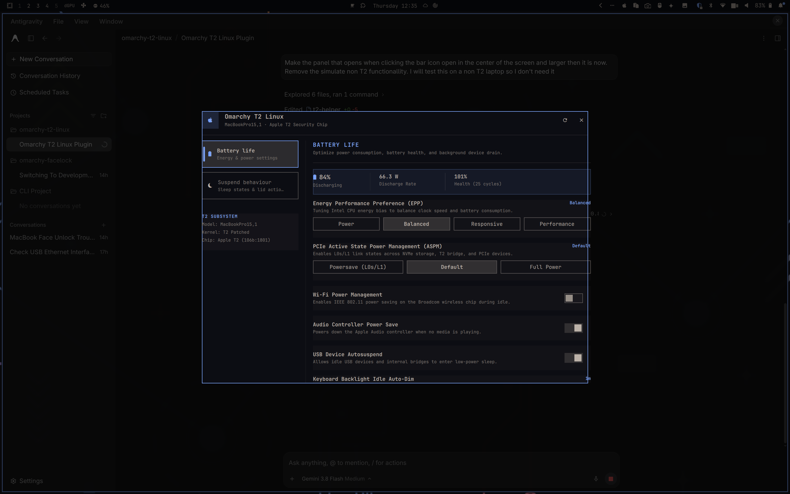

# Omapple

An [Omarchy](https://omarchy.org) status bar plugin and settings center for Apple hardware running Linux. It provides comprehensive controls for battery life, sleep/wake behavior, macOS keybindings, Force Touch trackpad gestures, and an Apple community plugin catalog—with specialized optimizations and fixes when an **Apple T2 Security Chip** is detected (2018–2020 Intel MacBook Pro, MacBook Air, and Mac mini).

Clicking the bar icon (``) opens a dedicated control panel with organized tabs for tuning hardware power profiles, suspend states, input ergonomics, and community extensions.



---

## Features & Categorized Options

The panel organizes all hardware tunables and configurations into dedicated vertical tabs:

### 1. Battery Life
- **Live Battery Telemetry**: Real-time battery charge percentage, charging/discharging status, real-time power discharge rate in Watts, and battery health percentage with cycle count.
- **CPU Energy Performance Preference (EPP)**: Set Intel CPU energy bias between `Power` (maximum battery life / throttles boost clocks), `Balanced` (recommended daily efficiency), `Responsive`, and `Performance`.
- **PCIe Active State Power Management (ASPM)**: Configure link power states across NVMe storage, Apple T2 bridge controllers, and PCIe lanes (`Powersave [L0s/L1]`, `Default`, or `Full Power`). Powersave drastically cuts idle package wattage.
- **Wi-Fi Power Management**: Toggle IEEE 802.11 power saving on the Broadcom wireless interface during network idle.
- **Audio Controller Power Save**: Powers down Apple/HDA Intel audio codecs when inactive (`power_save=1`) to eliminate audio controller background drain.
- **USB Device Autosuspend**: Allows idle USB devices and internal VHCI bridges to enter low-power sleep states.
- **Keyboard Backlight Auto-Dim**: Configurable idle timeout for keyboard illumination (`30s`, `1m`, `2m`, `5m`, or `Never`).

### 2. Suspend Behaviour
- **System Sleep Mode (`mem_sleep`)**:
  - `Deep (S3)`: Full Suspend-to-RAM. Completely powers off CPU and PCIe devices. Recommended on T2 MacBooks to prevent heat buildup and battery drain while stored in a backpack.
  - `Modern Standby (s2idle)`: Freeze standby mode with faster wake times.
- **Lid Close Action (On Battery)**: Choose between `Suspend`, `Do Nothing`, `Lock Screen`, or `Hibernate` when closing the MacBook display on battery power.
- **Clamshell Mode (On External Power / Display)**: Keep the MacBook awake when the lid is closed while connected to an external display and AC charger (`HandleLidSwitchExternalPower=ignore`), or always suspend.
- **Wake on Lid Open (LID0)**: Automatically resume the laptop from sleep as soon as the display lid is opened.
- **Wake on Charger Connect (ADP1)**: Wake the system from sleep whenever a USB-C or MagSafe charger is connected.
- **Hibernate Delay (Suspend-Then-Hibernate)**: Automatically transitions from suspend to hibernation after a set duration (`30 min`, `1 hour`, `2 hours`, or `Never`) to avoid battery exhaustion during long sleep intervals.
- **Touch Bar Blanking on Sleep**: Powers off the OLED Touch Bar display immediately before system sleep.

### 3. Keybindings
- **Task: Select All**: Change default Linux `CTRL + A` to `SUPER + A` (Command + A) for Mac muscle memory, or assign custom chords.
- **Task: Forward Delete**: Assign `SUPER + BACKSPACE` (Command + Backspace) as forward delete for Mac keyboards that lack a dedicated Delete key.
- **Task: Find**: Map `CTRL + F` search to `SUPER + F` (Command + F) or custom chords.
- **Task: Undo**: Map application undo from default `CTRL + Z` to `SUPER + Z` (Command + Z) or custom chords.
- **Task: Redo**: Map application redo from default `CTRL + SHIFT + Z` to `SUPER + SHIFT + Z` (Command + Shift + Z) or custom chords.
- **Task: Save**: Map document save from default `CTRL + S` to `SUPER + S` (Command + S) or custom chords.
- **Task: Cut**: Map clipboard cut from default `CTRL + X` to `SUPER + X` (Command + X) or custom chords.
- **Task: Reload**: Map active tab or document reload from default `CTRL + R` to `SUPER + R` (Command + R) or custom chords.
- **Task: Select Address**: Map address bar focus from default `CTRL + L` to `SUPER + L` (Command + L) or custom chords.
- **Conflict Detection & Dynamic System Shortcut Relocation**: Automatically checks whether a chosen shortcut is already registered in Omarchy Hyprland or within the plugin. If a conflict occurs with an existing system binding (such as `SUPER + F` for Omarchy's native `Full screen`), it safely relocates the system shortcut to an alternative chord (e.g. `SUPER + ALT + F`) under `Changed System Shortcuts`.
- **Interactive Key Combination Recorder**: Dedicated dialog that captures keystrokes in real time directly from the keyboard without manual typing.
- **Shortcut Reference**: Built-in guide for standard window manager and system shortcuts on Apple T2 keyboards.

### 4. Trackpad
- **Force Touch Trackpad Hardware**: Automatic detection and control of the internal Apple Magic Trackpad 2 engine with driver reset capabilities.
- **Pointer Speed (Sensitivity)**: Granular tracking speed adjustment from 0% to 100% (default: 50% / 0.0).
- **Acceleration Profile**: Toggle between `Adaptive` (macOS default dynamic acceleration) and `Flat` (linear 1:1 speed).
- **Two-Finger Scroll Speed**: Fine-tune scroll factor multiplier from 0.10x to 2.00x (default: 1.00x).
- **Natural Scrolling**: Invert scroll direction so document content tracks finger motion (macOS style).
- **Tap to Click**: Tap surface with 1 finger for left-click or 2 fingers for right-click without clicking down physically.
- **Two-Finger Secondary Click**: Click anywhere on the trackpad surface with two fingers for right-click instead of corner buttons.
- **Three-Finger Drag**: Native macOS gesture to move windows, select text, and drag objects with three fingers without pressing down (mutually exclusive with 3-finger workspace swiping).
- **Tap and Drag**: Double-tap and slide without physical click to drag windows or select text.
- **Tap Drag Lock**: Temporarily lift and reposition fingers during a drag gesture without dropping the selection.
- **3-Finger Horizontal Workspace Swiping**: Swipe left or right across the trackpad with three fingers to switch between virtual workspaces (mutually exclusive with 3-finger drag).
- **Middle Button Emulation**: Click left and right buttons simultaneously to emit middle click.
- **Multi-Finger Tap Button Order**: Switch between `LRM (Left/Right/Middle — Mac Default)` and `LMR (Left/Middle/Right — X11 Standard)`.
- **Disable While Typing (Palm Rejection)**: Temporarily disables trackpad pointer movement while typing on the built-in keyboard to prevent accidental thumb or palm touches.
- **Left-Handed Mode**: Swap primary and secondary button assignments for left-handed ergonomics.
- **Invert Horizontal / Vertical Axes (Flip X / Flip Y)**: Invert horizontal and vertical cursor motion.
- **One-Click Recommended Defaults**: Instantly configures optimal Mac trackpad experience (natural scrolling, 3-finger horizontal workspace swiping, adaptive acceleration, tap-to-click, and secondary click) integrated into both the dedicated Trackpad tab and the global "Apply recommended options" wizard.
- **Live Instant Preview & Persistent Configuration**: Generates `~/.config/hypr/t2-trackpad.lua` and applies settings live instantly via Hyprland IPC.

### 5. Sound
- **Audio Subsystem Overview**: Information on Apple T2 Cirrus Logic audio controller and hardware codecs.
- **Audio Controller Power Save**: Powers down internal Apple audio hardware when idle to eliminate background battery drain.

### 6. Plugins
- **Apple Community Plugins**: Discover, install, update, and manage Apple-related plugins from plugins.omarchy.org. When running on hardware with an Apple T2 chip, a dedicated "T2 plugins only" filter and badge highlight plugins built specifically for T2 MacBooks.

---

## Hardware Detection & T2 Subsystem Support

The plugin automatically detects your hardware on startup:
- Probes `/sys/bus/pci/devices/*/device` for PCI Vendor `0x106b` and Device IDs `0x1801` / `0x1802` (Apple T2 Bridge Controller & Secure Enclave Processor).
- Checks DMI system identifiers (`product_name` and `sys_vendor`).

### Adaptive Hardware Handling
- **Apple T2 MacBooks** (2018–2020 Intel MacBook Pro, MacBook Air, and Mac mini): Unlocks specialized T2 controls, including the one-click "Apply T2 fixes only" button, PCIe port compatibility tunables, T2 audio power management, Touch Bar sleep blanking, and T2-specific plugin filtering.
- **Other Apple & Linux Hardware**: Provides the full suite of battery life optimizations, CPU EPP profiles, sleep/wake settings, Force Touch trackpad gestures, macOS keybindings, and Apple community plugins, while automatically hiding controls that only apply to T2 chips.

---

## Installation & Setup

### 1. Enable in Omarchy Shell
```bash
omarchy plugin add https://github.com/bramvanoploo/omarchy-t2-linux.git --enable
```

### 2. (Optional) Install System Polkit Rule
To allow modifying privileged hardware settings (such as PCIe ASPM, CPU EPP, and sleep modes) without repetitive authentication prompts:
```bash
sudo ~/.config/omarchy/plugins/bramvanoploo.omarchy-t2-linux/setup-system
```
To remove the polkit rule and privileged helper:
```bash
sudo ~/.config/omarchy/plugins/bramvanoploo.omarchy-t2-linux/teardown-system
```
---

## Uninstall

### 1. Remove System Polkit Rule (if added)
```bash
sudo ~/.config/omarchy/plugins/bramvanoploo.omarchy-t2-linux/teardown-system
```

### 2. Remove plugin from Omarchy Shell
```bash
omarchy plugin remove bramvanoploo.omarchy-t2-linux
```

---

## Shell IPC Controls

You can trigger panel actions directly via Quickshell IPC:
```bash
# Open centered panel
qs -p /usr/share/omarchy/shell ipc call bramvanoploo.omarchy-t2-linux open

# Toggle centered panel
qs -p /usr/share/omarchy/shell ipc call bramvanoploo.omarchy-t2-linux toggle

# Close panel
qs -p /usr/share/omarchy/shell ipc call bramvanoploo.omarchy-t2-linux close
```

---

## License

MIT License. See [LICENSE](LICENSE) for details.
